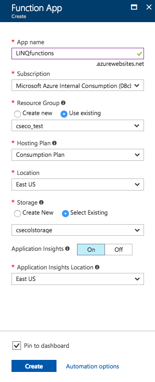
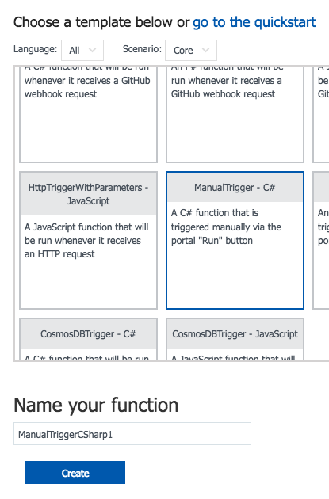

# Using LINQ in Azure Functions
This is a short tutorial on how to use LINQ properly in Azure Functions

> LEARN MORE. If you are not familiar with Azure Functions I recommend you read the <a href="https://docs.microsoft.com/en-us/azure/azure-functions/">official documentation here</a>. There are amazing samples and guides to start from zero. You will also need an Azure account. If you don't have one, you can <a href="https://azure.microsoft.com/en-us/free/?v=17.39a">start for free here</a>.

## What is LINQ? ##
<i>Language-Integrated Query (LINQ) is the name for a set of technologies based on the integration of query capabilities directly into the C# language. Traditionally, queries against data are expressed as simple strings without type checking at compile time or IntelliSense support. Furthermore, you have to learn a different query language for each type of data source: SQL databases, XML documents, various Web services, and so on. With LINQ, a query is a first-class language construct, just like classes, methods, events.</i> - <a href="https://docs.microsoft.com/en-us/dotnet/csharp/programming-guide/concepts/linq/">Official LINQ documentation</a>

Basically, what LINQ allows us is to make these type of queries:

```csharp
using System;
using System.Collections.Generic;
using System.Linq;

namespace linqBasics
{
    class MainClass
    {
        public static void Main(string[] args)
        {
            int n = int.Parse(Console.ReadLine());

	    Random random = new Random();
            int[] temperature = new int[n];

            for (int i = 0; i < n; i++)
            temperature[i] = random.Next(1, 100);
		
            // Query syntax
            IEnumerable<int> results =  from x 
                                        in temperature 
                                        where x >= 50 
                                        select x;

            // Method syntax
            IEnumerable<int> results2 = temperature.Where(num => num <= 50);

            Console.WriteLine("Results: ");
            foreach (int x in results)
                Console.WriteLine(x);

            Console.WriteLine("Results 2: ");
            foreach (int x in results2)
                 Console.WriteLine(x);
            
            Console.ReadLine();
        }
    }
}

```
And we can query not just arrays or lists but also objects in general, XML files and SQL databases as we wll do later.

As you can see there are two types of querying styles: Query syntax and Method syntax. You can learn about their differences, pros and cons at the <a href="https://docs.microsoft.com/en-us/dotnet/csharp/programming-guide/concepts/linq/standard-query-operators-overview">LINQ Documentation</a>. In this article we will mostly used query syntax when querying our database.

In this repo you will find your ways to do basic operations to a SQL Server Database using LINQ in Azure Functions, we will cover how to:
- Add a new row to a table
- Update a row
- Delete a row
- Querying single and multiple tables using LINQ query syntax

## Creating an Azure Function App ##
After logging in to our Azure Account we click the 'New' button on the upper left side on the page and type <i>'function'</i> in the search bar:


Once we click the 'Create' button after selecting 'Function App' in the previous menu we will find the next form in which will fill some basic information regarding our Function App



## Creating our functions ##
A Function App in Azure can host multiple Functions so we will leverage this to have a single function for each operation we will work on at this repo.

### Adding our SQL Server connection string ###
Before starting to use LINQ we will add out database connection string to our Function App: We have to click on 'Application Settings' which is located under the 'Configured features' sub menu in our recently created Function App:


Once there we find a sub menu called 'Connection strings'. We create a new value by pasting our database connection string and giving a name to the connection:


> TIP. Remember to change add your password and username to your connection string. Also, select your database type at the right side of the connection string value. For this repo we're working with SQL Azure.

### Creating our first function ###
Azure Functions have many ways to interact with users including Triggers, Inputs and Outputs form multiple sources. We can:
- Trigger a function using an EventHub,
- Use blob storage as an input,
- Write directly to a Cosmos DB table,
- among other scenarios.

For this specific repo we will use a manual trigger for our Functions. That means, the function will be activated only when we push a "Run" button on the function site

To create a new function we just click the '+' button in our Functions menu. Once there we select 'Custom function' below the 'Get started on your own' sub title:


Here we will look for the ManualTrigger template written in C#, give it a name and click the 'Create' button:


> NOTE. While a manual trigger might not be a real live scenario,it is a good enough scenario for what we want to achieve which is using LINQ to query a database.

### Mapping our database tables to C# classes ###
We can do this manually, for each table we can create a class with a 'TableAttribute' indicating the name of such table and a 'ColumnAttribute' for each attribute:

```csharp
[Table(Name = "SalesLT.Product")]
public class SalesLT_Product
{
    [Column(Name="Name")]
    public string Name {get;set;}
}
```
> LEARN MORE. You can find regarding <a href="https://docs.microsoft.com/en-us/dotnet/api/system.data.linq.mapping.columnattribute?view=netframework-4.7">ColumnAttribute</a> and <a href="https://docs.microsoft.com/en-us/dotnet/api/system.data.linq.mapping.tableattribute?view=netframework-4.7">TableAttribute</a> on their respective documentation. 

However there will be times when our database is composed of multiple tables, probably dozens of them, each of one with other dozens of attributes. In those times it will probably be better to use mapping tools to automate this process. On this ocassion we will use a command called <a hred="https://docs.microsoft.com/en-us/dotnet/framework/tools/sqlmetal-exe-code-generation-tool">SqlMetal.exe</a>, but there are other ways to do it, find <a href="https://docs.microsoft.com/en-us/dotnet/framework/data/adonet/sql/linq/how-to-generate-the-object-model-in-visual-basic-or-csharp">more info here</a>.

#### Using SqlMetal.exe ####
It is fairly easy to use SqlMetal.exe. If we have installed Visual Studio on our machines, we already have to tool at our PCs, if not we just have to download the <a href="https://www.microsoft.com/en-us/download/details.aspx?id=8279">Windows SDK from here</a>
Now let's open a Developer Command Prompt and type the next command
```
sqlmetal /code:{FileNameOfYourGeneratedCode.cs} /conn:"{YourDataBaseConnectionString}"
```

This command will result into a new CS file containing your new classes that have mapped your entire database.

> TIP. You don't need to map ALL your database if you only want to query a couple of tables as long as such tables are not related to other tables that will not be mapped.

#### Uploading a file to your Function App ####
Now that we have our CS file with our mapped tables into classes we need to upload said file to our Azure Function App. This is easier done than said:
We go to our Function App Settings page by clickin on the App name, and then click on Advanced Tools (Kudu) located in the lower center part of the page:


Once there we go to the 'Debug Console' tab and select 'CMD':


We now have to navigate to the directory of our function. The location will be something similar to:
```
D:\home\site\wwwroot\{NameOfOurFunction}
```

and once in our Function folder we drag & drop our CS file (in our example the file name is 'mappedClasses.cs':


### Exercise 1: Querying a single table ###
With our mapped table and connection string in place we are ready to use LINQ to query our database:

First we need to add a reference to System.XML.Lin on our mappedClasses.cs file before our 'Using' statements:

```javascript
#r "System.XML.Linq"
```

Then, at our run.csx file we will add some references to librarys and to our mappedClasses.cs file as well:

```javascript
#r "System.Data.Linq"
#r "System.Data"
#r "System.Configuration"
#load "mappedClasses.cs"
```

Now let's code:

First we need to acquire our connection string we saved in the App Settings moments ago, we can do this by writing the next line:

```csharp
string connString = ConfigurationManager.ConnectionStrings["connString"].ConnectionString;
```
> NOTE. Remember we named our connection string 'connString' in the App Settings.

Now that we have the connection string is time to connect to our database using the DataContext class and using its GetTable method:

```csharp
DataContext db = new DataContext(connString);
Table<SalesLT_Product> products = db.GetTable<SalesLT_Product>();
```

Querying time, as mentioned before we will use the Query syntax type a simple query would look like this:
```csharp
    IQueryable<SalesLT_Product> results = from product 
                                        in products 
                                        where product.Color == "Black"
                                        select product;

```
This query will get us the same outcome as the next T-SQL query:
```sql
select * from SalesLT.Product where Color = "Black"
```

>TIP. The variable 'product' could have any name as it is only a nickname for the values that will be retrieved. 

How can we look at the results returned? Simply by iterating over our 'results' variable:
```csharp
foreach (SalesLT_Product item in results)
{
    // Do something here
}
```

The complete code will look like this:

```csharp
public static void Run(string input, TraceWriter log)
{
    string connString = ConfigurationManager.ConnectionStrings["connString"].ConnectionString;
    
    DataContext db = new DataContext(connString);
    Table<SalesLT_Product> products = db.GetTable<SalesLT_Product>();

    IQueryable<SalesLT_Product> results = from product in products select product;

    int count =1; 
    foreach (SalesLT_Product item in results)
    {
        log.Info($"{count}-{item.Name}");
        count++;
    }
    log.Info($"You have a total of {results.Count()} products");
}
```
>output:
```

2017-10-10T19:53:34.752 1-HL Road Frame - Black, 58
2017-10-10T19:53:34.752 2-HL Road Frame - Red, 58
2017-10-10T19:53:34.752 3-Sport-100 Helmet, Red
2017-10-10T19:53:34.752 4-Sport-100 Helmet, Black
2017-10-10T19:53:34.752 5-Mountain Bike Socks, M
2017-10-10T19:53:34.752 6-Mountain Bike Socks, L
2017-10-10T19:53:34.752 7-Sport-100 Helmet, Blue
2017-10-10T19:53:34.752 8-AWC Logo Cap
2017-10-10T19:53:34.752 9-Long-Sleeve Logo Jersey, S
2017-10-10T19:53:34.752 10-Long-Sleeve Logo Jersey, M
... more
```

### Exercise 2: Querying multiple tables ###
### Exercise 3: Creating a new row ###
### Exercise 4: Updating a row ###
### Exercise 5: Deleting a row ###